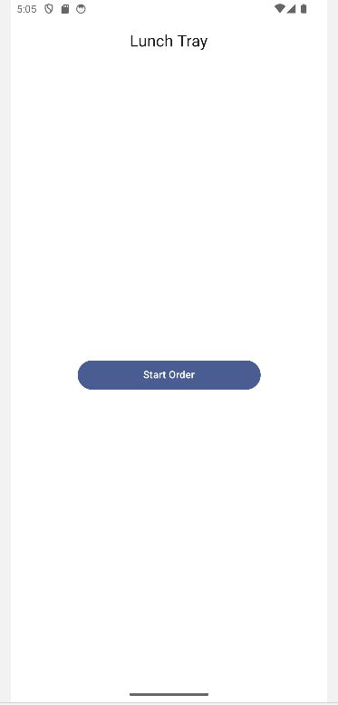
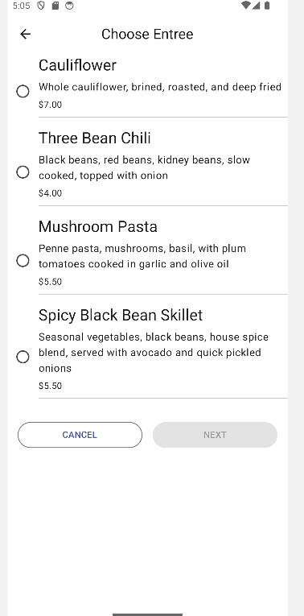
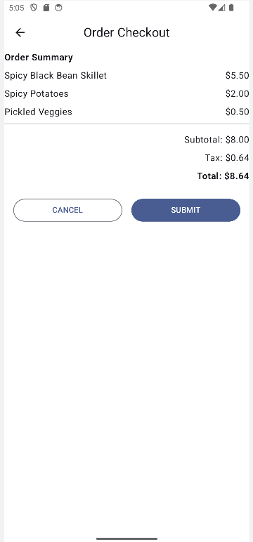

# 🍽️ **LunchTray**
**LunchTray** is a modern Android application that lets users customize and order their lunch. The app is designed to showcase Android development best practices using Jetpack Compose and an MVVM architecture.

## 🚀 **Features**
   - 🛒 **Control customization**
      - **Starters**: Choose from a variety of available starters.
      - **Side dishes**: Select side dishes like rice or pickled vegetables.
      - **Main dishes**: Explore dishes like pasta or bean chili.
   - 💲 **Dynamic Price Calculation**
      - The total price is calculated in real time, including taxes.
      - Prices are displayed in a clear format adapted to the local currency.
   - 📝 **Order Summary**
      - View a detailed summary of the order: main course, side dishes, price, etc.
      - Options to confirm or cancel the order.
   - 🗺️ **Intuitive Navigation**
      - **Start Screen**: Launch order.
      - **Starters menu**: Select main course.
      - **Side dishes menu**: Choice a main course.
      - **Payment screen**: Order validation and cost calculation.
   - 🎨 **Modern Interface**
      - Built with Jetpack Compose for a smooth, declarative user experience.
      - Integration of Material 3 for an aesthetic and coherent design.
   - 📤 Order Sharing:
      - Share your order summary (menu details, total price) with other applications such as messaging or email apps.

## 🛠️ **Tech Stack**
   - **Kotlin**: Modern and concise language.
   - **Jetpack Compose**: Declarative UI Toolkit for Android.
   - **Material 3**: Modern and accessible user interface.
   - **StateFlow**: Reactive state management for real-time updates.
   - **ViewModel**: MVVM architecture to separate business logic from user interface.
   - **Navigation Component**: For seamless screen transitions.

## 📂 **Project Structure**
**Packages**:
1. **Datasource**:
   - Defines the data available as menu items.
2. **Model**:
   - Defines data models, including user interface state (OrderUiState).
3. **Ui**:
   - Implements the user interface using Jetpack Compose.
   - Contains key screens such as:
      - **StartOrderScreen**: Order launch.
      - **Menu Screens**: Dishes selection.
      - **CheckoutScreen**: Order summary.
   - Manages navigation between screens.
4. **ViewModel**:
   - Contains order management logic (OrderViewModel).
   - Calculates prices dynamically and manages order updates.

## 🚀 **How to Use**
1. **Launch the App**: 
   - Open the App on a device or emulator.
2. **Customize Your Order**:
   - Choose an appetizer, side dish and main course.
3. **Navigate Between Screens**:
   - Use the navigation buttons to move from one screen to another.
4. **View summary**:
   - View your order summary and total costs.
5. **Enjoy**:
   -Explore the different options to discover the features.

## 📸 **Screenshots**
- **Start Screen**:
  
- **Menu Screen**:
  
- **Checkout Screen**:
  